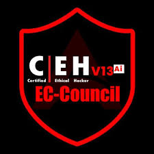

  

---

💫 **ABOUT ME**

- 🔭 I’m currently working on **CyberSec Multi-Tool Launcher (CMTL) & Forensic Analyzer**  
- 🤝 I’m looking for collaboration on **🧠 AI-Powered Phishing Email Detector**  

- 🌱 Learning **Digital Forensics, Pentesting & AI/ML in Cybersecurity**  
- 👨‍💻 All my projects are available at [GitHub](https://github.com/isayani-78)  
- 💻 Resume Portfolio: [sayanimaity78.site](https://sayanimaity78.site)  
- 💬 Ask me about **Digital Investigations & Ethical Hacking**  
  
|  | **CEHv13 AI Certified (Global Certification🌍 from Ec-council)** |
|---------------------------|-----------------------------------|
|**CHFI Trained** – Digital Forensics & Cyber Investigations |
|**CTIGA, CCEP, CPPS, CRTOM** –  Certifications based on Threat Intelligence, Cybersecurity & Pen Testing |
|  | **Top 5% on TryHackMe** |

---

  **
 🌱 Give me another chance, wanna grow up once again..... 
**

  
---
# 💻 My Workspace

##  Virtualization & Pentesting OS

---

## Connect with me 💻  

  
  &nbsp;
  
  &nbsp;
  
  &nbsp;
  
  &nbsp;
 <a href="https://medium.com/@isayani-78" alt="Sayani Maity | Medium">
  &nbsp;
  
  &nbsp;
  

---

### Tech Stacks 💻 
                    

---

## 📊 GitHub Stats

  

  

  

 

---
## 🏆 GitHub Trophies

  

---
## CTF Badges
---
### 🔝 Contribution

---

### ✍️ Random Dev Quote

   

